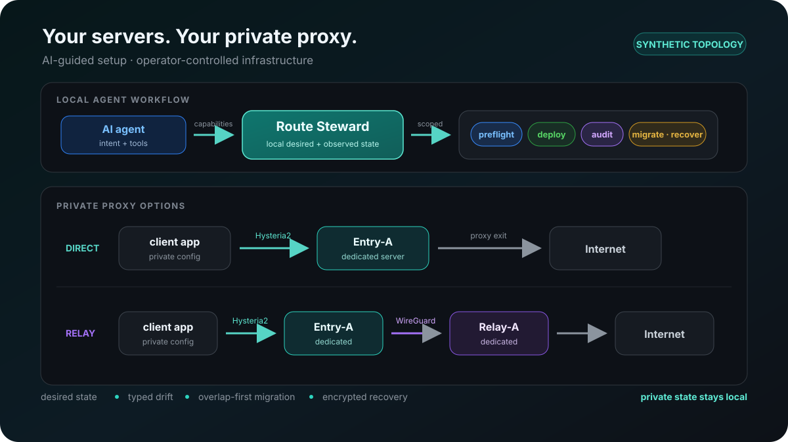

# Route Steward

[English](README.md) · [简体中文](README.zh-CN.md) · [日本語](README.ja.md) · [Español](README.es.md) · [Português (Brasil)](README.pt-BR.md)

[Quickstart](docs/QUICKSTART.md) · [FAQ](docs/FAQ.md) · [Compatibility](docs/COMPATIBILITY.md) · [Operating boundary](docs/OPERATING-BOUNDARY.md) · [Security](SECURITY.md) · [Releases](https://github.com/squarepots/route-steward/releases)

[](https://github.com/squarepots/route-steward/actions/workflows/ci.yml)

**Set up and manage private proxies on your own servers with an AI agent.**

Route Steward helps an AI agent set up, inspect, change, and recover a private proxy on VPS servers you control. Give the agent this GitHub URL: it can discover the supported workflow, check prerequisites before every change, operate through the native `route-steward` executable, and return sanitized results without exposing credentials or local paths.



## Give the URL to an AI agent

Paste this prompt into Codex or another agent that can read files and run local commands:

```text
Open https://github.com/squarepots/route-steward and help me set up and manage a private proxy on my own servers. Clone it if needed, read AGENTS.md and .agents/skills/route-steward/SKILL.md, then use the release binary or build the Go CLI. Run capabilities before asking for infrastructure details. Explain the dedicated-host requirements and host effects, keep operational state private, run preflight before every change, and return sanitized results.
```

The agent starts with:

```text
route-steward capabilities
route-steward bootstrap --private-dir ./private
route-steward context --private-dir ./private
```

No PowerShell or Node.js is required for normal use. Download a verified binary for Linux, macOS, or Windows from [Releases](https://github.com/squarepots/route-steward/releases), or build from source with Go 1.27:

```text
go install github.com/squarepots/route-steward/cmd/route-steward@latest
```

Node.js is used only when you choose the optional Cloudflare Worker subscription delivery.

## What it gives you

- a private Hysteria2 proxy through one server, or through an optional two-server WireGuard relay;
- optional bounded Hysteria2 port hopping for per-port UDP throttling or filtering, with one tested client contract;
- complete private configuration for a Mihomo/Clash Verge-compatible app, Karing, Shadowrocket, or a headless Linux/application proxy;
- read-only server audit, real on-demand client traffic health, and typed configuration drift;
- resumable overlap-first server replacement with health-gated client switching and no automatic retirement;
- encrypted local recovery with verified, relocatable private state;
- one machine-readable interface for command-line and local stdio MCP use.

The current server baseline is a dedicated, rebuildable Ubuntu 24.04 amd64 VPS with authorized SSH key access. Exact protocols, clients, topology, and optional delivery are listed in [Compatibility](docs/COMPATIBILITY.md).

## Host effects and privacy

Initial setup prepares the whole host, including firewall, swap, SSH, sysctl, logging, updates, packages, and monitoring. Operational state, keys, generated client files, and recovery archives stay in the private directory you select and are excluded from Git. A cloud AI runtime may still process the server address, SSH username, key path, and IDs supplied as operation inputs; use an offline runtime when those inputs must remain local.

Use only servers, accounts, and network resources you own or are authorized to administer. Read [Operations](OPERATIONS.md), [Privacy](docs/PRIVACY.md), and [Security](SECURITY.md) before deployment.

Route Steward is [AGPL-3.0-only](LICENSE). The vendored QR generator retains its MIT attribution in [client/vendor/NOTICE.md](client/vendor/NOTICE.md).
